# Anteskogs Game Reviews

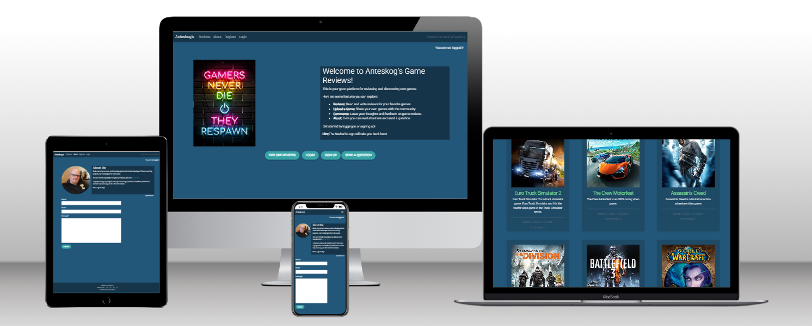


Anteskog's Game Reviews is a full-stack website build using Django, Python, CSS. 

This was created as my third milestone project.

I wanted to mention that I have dyslexia and have gone through the code many times. I really hope the spelling is correct.

[Visit Anteskog's Game Reviews Here](https://anteskogs-game-reviews-c55343667d70.herokuapp.com/)


# CONTENTS

* [User Experience](#user-experience)
    * [Strategy Plane](#strategy-plane)
        * [Project Goals](#project-goals)
    * [Scope Plane](#scope-plane)
    * [Feature Planning](#feature-planning)
    * [Structure plane](#structure-plane)
        * [User Stories](#user-stories)
        * [Database Schema](#database-schema)
    * [Skeleton Plane](#skeleton-plane)
        * [Wireframes](#wireframes)
    * [Surface Plane](#surface-plane)
        * [Colour Scheme](#colour-scheme)
        * [Typography](#typography)
        * [Images](#images)
        * [Base Mockup](#base-mockup)
    *[Features](#features)
        * [General Features of the site](#general-features-of-of-the-site)
        * [Sites header and footer images](#sites-header-and-footer-images)
        * [Defensive Programming](#defensive-programming)
        * [Features for the next level](#features-for-next-version)
        * [Home Page](#home-page)
        * [Reviews Page](#reviews-page)
        * [About Page](#about-page)
        * [Admin Page for managing the site](#admin-page-for-managing-the-site)
        * [Signup Page](#signup-page)
        * [Log in page](#log-in-page)
        * [Log out page](#log-in-page)
    * [Future Implementations](#future-implementations)
    * [Accessibility](#accessibility)
    * [Technologies Used](#technologies-used)
    * [Languages Used](#languages-used)
    * [Databas Used](#database-used)
    * [Frameworks Used](#frameworks-used)
    * [Libraries & Packages Used](#libraries--packages-used)
    * [Program Used](#program-used)
    * [Deployment & Local Development](#deployment--local-development)
        * [Heroku app setup](#heroku-app-setup)
        * [Preparation for deployment in VSCode](#preparation-for-deployment-in-vscode)
    * [Testing](#testing)
    * [Credits](#credits)
        * [Code used](#code-used)
        * [Content](#content)
        * [Media](#media)
        * [Acknowledgments](#acknowledgments)


---

## User Experience

### Strategy Plane

#### **Project Goals**

Anteskog's Game Reviews is a Review / Blog.

The sites primary audience will be people who love gaming, it will work as a community. You are abel to upload, comment and edit all of your work you put in there!


### Scope Plane

#### **Feature Planning**

### Structure Plane

#### **User Stories**

| User Story ID | As a/an | I can | So that i can... |
| :--- | :--- | :--- | :---|
| 1 | User | Click on a review | Read the full text |
| 2 | User/Admin | View comments on a individual post | Read the conversation |
| 3 | User | Register an account | Comment on a review |
| 4 | User | Leave comments on a review | Share my opinion |
| 5 | User | Modify or delete my comment | Be involved in the conversation |
| 6 | Admin | Create, Read, Update and Delete | Manage my blog content |
| 7 | Admin | Approve or disapprove comments | Filter out bad comments |
| 8 | User | Log in and see my uploaded games | I can easy edit or delete them |


#### **Database Schema**

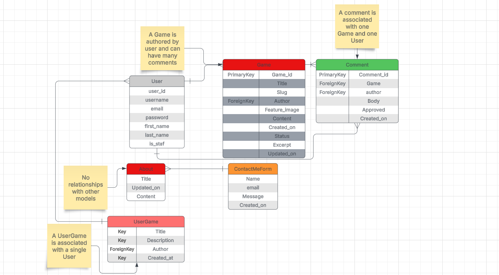


### Skeleton Plane

#### **Wireframes**

Wireframes for the project were created using [Balsamiq](https://balsamiq.com/)

* Home Page

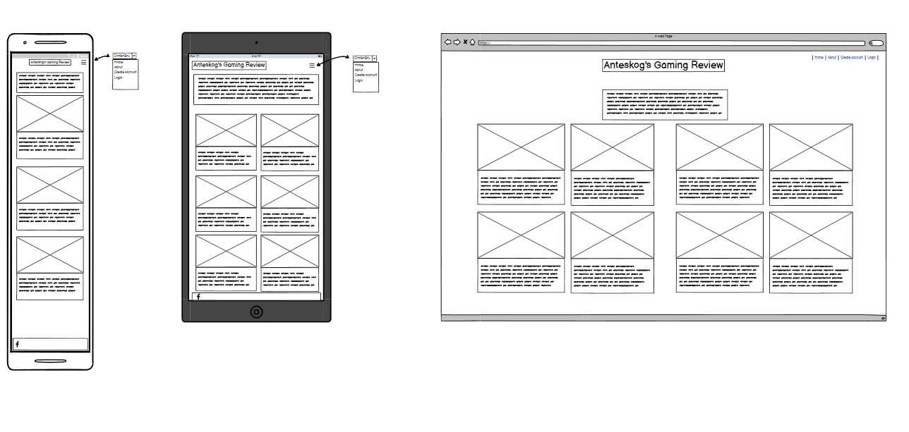

* Review Detail Page

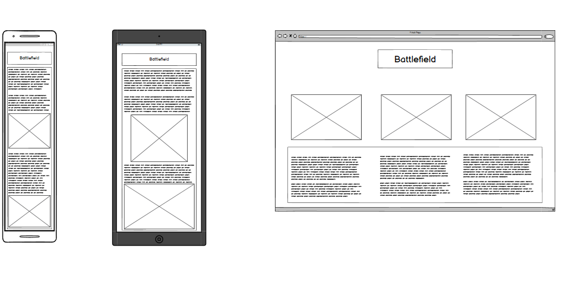

* About

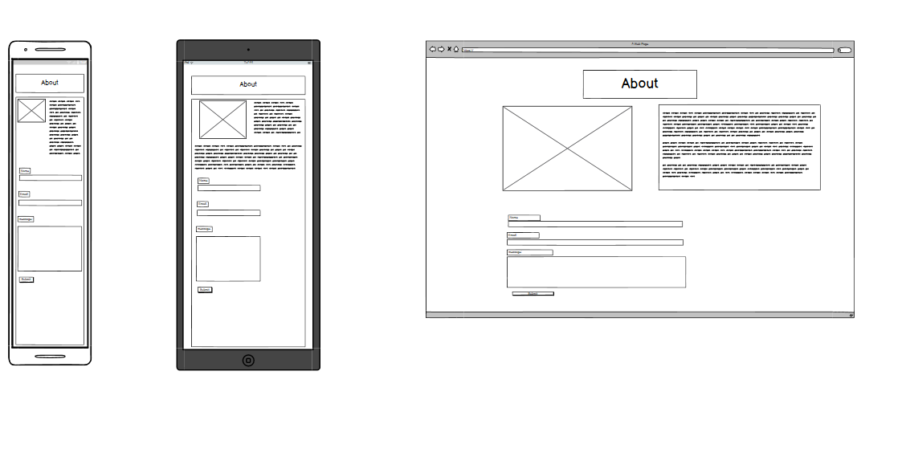


### Surface Plane

#### **Colour Scheme**

I didn't know what color I should use, so I did use Google and stumble over this site https://coolors.co/ and come upp with this :

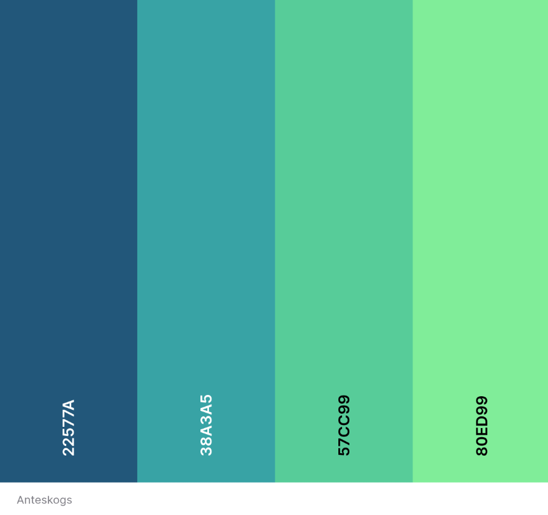

#### **Typography**

All fonts were sourced from [Google Fonts](https://fonts.google.com/).
I have used [Lato](https://fonts.google.com/specimen/Lato)  and [Roboto](https://fonts.google.com/specimen/Roboto?query=Roboto) 

#### **Imagery**

All images have been found on [Wikipedia](https://www.wikipedia.org/)

## Features

### General Features of of the site

Each page of the site shares the following:

* Navbar - The navbar is the same through the site.
The Navbar with the name Anteskog' is function as a link to home page, and then 4 links when not logged in and 5 links if you are logged in.


* Footer - The footer is the same through the site.
The Footer contains four links to Facebook, Twitter, Instagram and Youtube.


### **Before Sign in**
#### **Home Page**
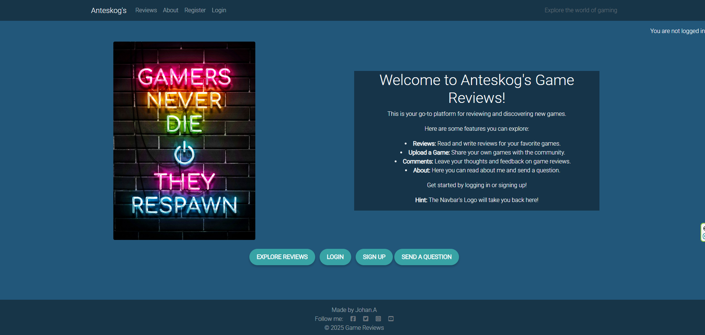
The home page of the site features a welcoming message, a picture and a list of features to explore. After that you will find four buttons that are linked to four different places: Reviews, Login, Sign up and send a question (About Page).
When you are signed in and ready to go the buttons will change to the following: Explore Reviews, Logout, Upload a Game and Send a question (About Page).

#### **Review Page**
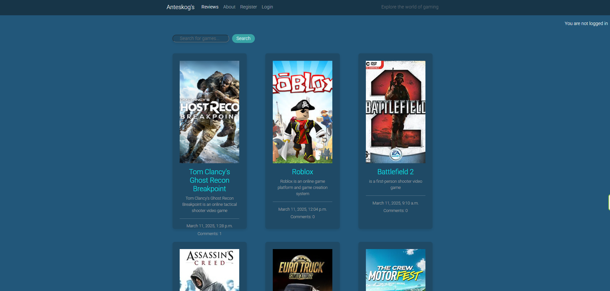
The Review Page is the *Big* page it is here all the games are gathered 6's Post's in each page.
All posts have a image and a header text that are clickable,
all have a little box bellow with example text, date, time and comments count are visible.


#### **About Page**
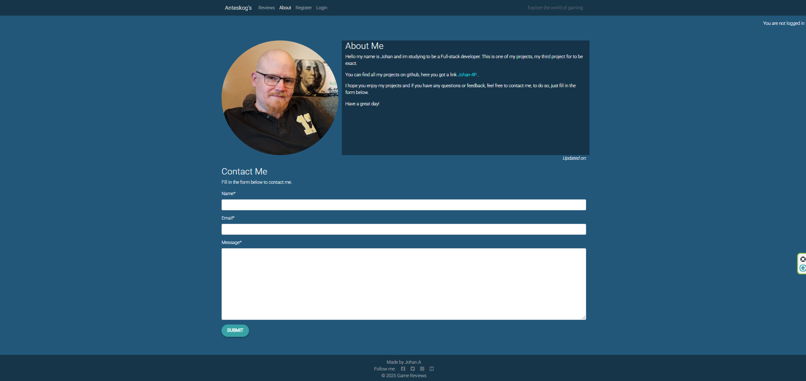
The About Page is a page about me. A picture of me is shown and the text about me with information, and bellow it is a form you can fill in if you want to send me a question with a Submit button.
When you have **Submit** you will go to the Thank you page.

#### **Review-Detail Page - Not Sign In**
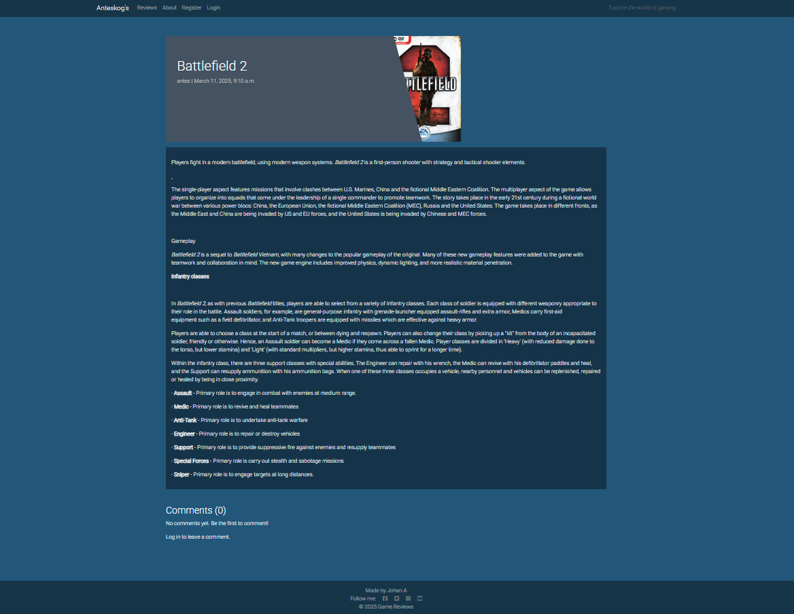
A big header with the name of the game and a picture of the game.
Text about the game and maybe a image in the game, after that the comments section begins.
If not logged in you only can read the comments but not comment on the game.

#### **Sign Up Page**
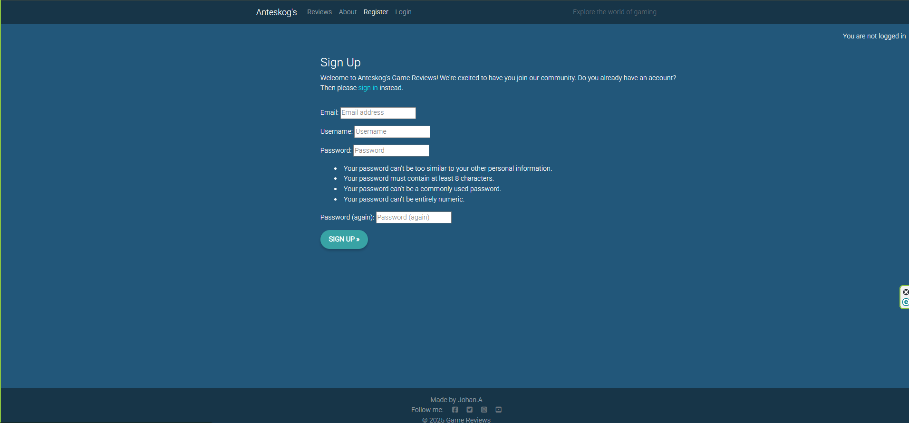
Sign up page have a welcome text and a form to fill out.

#### **Sign In Page**
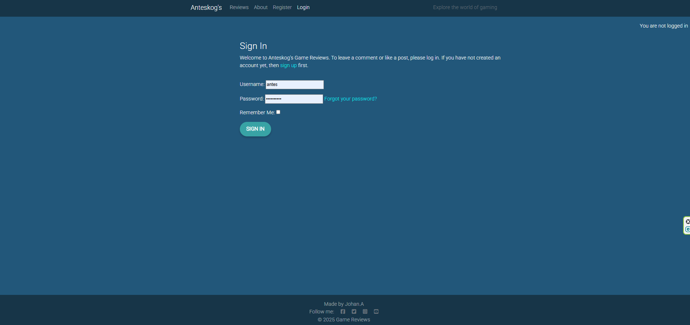
Welcome text and link to Sign Up if you haven't done so.
Form for log in.

## **After Sign In**
These links are the same : **Reviews**, **About**.
#### **Review-Detail Page**
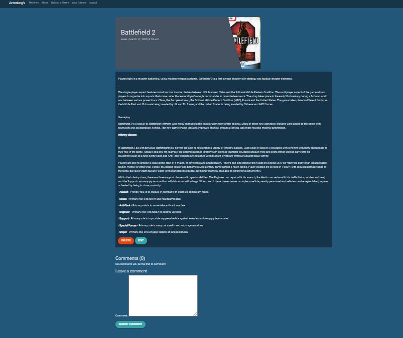

I Refer to [Review-Detail Page - Not Sign In](#Review-Detail-Page--NotSign-In),
**but** after the text you will now be abel to Comment on the game and edit and delete your comment.
Are you the owner of the game it will show up an edit and delete button for the game as well.


#### **Upload a Game Page**
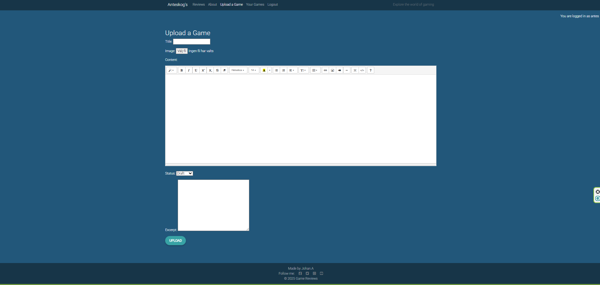
Is a form with Title, Upload of a image, Field of content, dropdown with Draft or Publish and a Excerpt field.

#### **Your Games Page** 
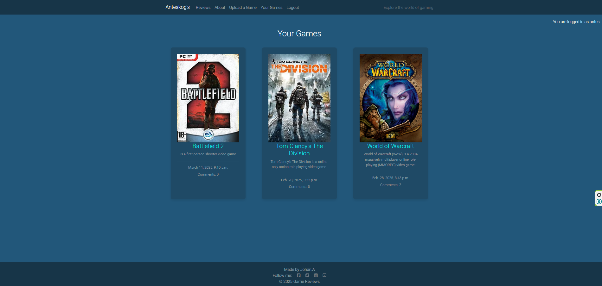
Here will all your Game show up and you can click them and Edit / Delete them.


#### **Logout Page**
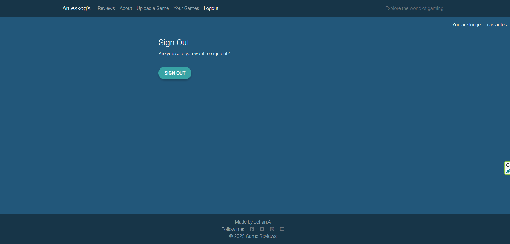
A simple Logout page with a question : Are you sure you want to sign out?

### Technologies Used
#### Languages Used
HTML, CSS, Python
#### Databas Used
[PostgreSQL](https://www.postgresql.org/) - Database.

[Heroku](https://www.heroku.com/) - Deployed site.
#### Frameworks Used
[Django](https://www.djangoproject.com/) - Version 5.1.6 - A high-level Python web framework that encourages rapid development and clean, pragmatic design.

[Bootstrap](https://getbootstrap.com/docs/4.6/getting-started/introduction/) - Version 5.0.1 - A framework for building responsive, mobile-first sites.
#### Libraries & Packages Used

[Django Allauth](https://django-allauth.readthedocs.io/en/latest/) - Version 65.4.1 - Used for authentication, registration & account management.

[Django Clouinary Storage](https://pypi.org/project/cloudinary/) - Version 0.3.0 - Used for Storage of pictures.

[django_crispy_forms](https://pypi.org/project/django-crispy-forms/) - Version 2.3 - provides a tag and filter that lets you quickly render forms.

[gunicorn](https://pypi.org/project/gunicorn/) - Version 23.0.0 - a Python WSGI HTTP Server.

[pillow](https://pypi.org/project/pillow/) - Version 11.1.0 - Python imaging library.

[dj_databsae_url](https://pypi.org/project/dj-database-url/) - Version 2.3.0 - allows us to utilise the DATABASE_URL variable.

[Whitenoise](https://pypi.org/project/whitenoise/) - Version 6.9.0 - Radically simplified static file serving for Python web apps.


### Program Used

[Am I Responsive](https://ui.dev/amiresponsive) - To create the responsive images of the site on a variety of device sizes.

[Balsamiq](https://balsamiq.com/) - Used to create wireframes.

[Lucid Chart](https://www.lucidchart.com/) - Used to create the database schema.

[Favicon.io](https://favicon.io/) - To create the favicon.

[Git](https://git-scm.com/) - For version control.

[GitHub](https://github.com/) - To save and store the files for this project.

[Google Dev Tools](https://developer.chrome.com/docs/devtools/) - To troubleshoot, test features and solve issues with responsiveness and styling.

[Pip](https://pypi.org/project/pip/) - A tool for installing Python packages.

### Deployment

The project is deployed using Heroku. To deploy the project:

#### **Create the Live Database**

Got my database by email from Code institute.

#### **Heroku app setup**

  1. From the [Heroku dashboard](https://dashboard.heroku.com/), click the new button in the top right corner and select create new app.
  2. Give your app a name (this must be unique), select the region that is closest to you and then click the create app button bottom left.
  3. Open the settings tab and create a new config var of `DATABASE_URL` and paste the database URL you copied from elephantSQL into the value (the value should not have quotation marks around it).

#### **Preparation for deployment in VSCode**

Before deploying your project to a platform like Heroku, you need to make sure your development environment in VSCode is set up correctly. Follow these steps:

1. Set Up Virtual Environment
First, create and activate a virtual environment to manage dependencies:

* Create a virtual environment:

```python
python -m venv venv
```
* Activate the virtual environment:
On macOS/Linux:
```python 
source venv/bin/activate 
```
* On Windows: 
```python
venv\Scripts\activate
```
2. Install Dependencies

Install all necessary dependencies listed in the requirements.txt file. This includes Django, Gunicorn, and any other required libraries for the project:
```python
pip install -r requirements.txt
```
3. Set Up Environment Variables

You need to set up environment variables for your project to keep sensitive data safe. Create a .env file in the root of your project and add the following:

Example .env file:
```python
SECRET_KEY='your-secret-key'
DEBUG=False
DATABASE_URL='your-database-url'
ALLOWED_HOSTS='your-heroku-app.herokuapp.com, localhost'
```
Ensure your settings.py is configured to load these environment variables:
```python
import os
from dotenv import load_dotenv
load_dotenv()

SECRET_KEY = os.getenv('SECRET_KEY')
DEBUG = os.getenv('DEBUG', default=False)
DATABASES = {
    'default': dj_database_url.config(default=os.getenv('DATABASE_URL'))
}
ALLOWED_HOSTS = os.getenv('ALLOWED_HOSTS').split(',')
```
Install the python-dotenv package, if it’s not already in your requirements.txt:
```python
pip install python-dotenv
```
4. Check Your Static Files

Make sure your static files (CSS, JavaScript, images) are properly configured. In settings.py, configure the static files settings like this:
```python
STATICFILES_DIRS = [os.path.join(BASE_DIR, 'static')]
STATIC_URL = '/static/'
```
5. Prepare for Database Connection

Make sure your project is connected to the correct database. If you're using PostgreSQL, configure your database connection string in settings.py using dj-database-url.

Example:
```python
import dj_database_url
DATABASES = {
    'default': dj_database_url.parse(os.getenv('DATABASE_URL'))
}
```
6. Run Migrations

Before deploying, run migrations to set up your database:
```python
python3 manage.py migrate
```

7. Create a Procfile

Create a Procfile in the root directory to tell Heroku how to run your app. Add the following line to the file:
```python
web: gunicorn your_project_name.wsgi:application
```
8. Test Your Application Locally

Run the development server to make sure everything works as expected locally:
```python
python3 manage.py runserver
```
9. Commit Changes to Git

Once everything is set up, commit your changes to Git:
```python
git add .
git commit -m "prepare for deployment"
git push origin main
```
10. Deploy to Heroku

Follow the Heroku deployment instructions or push the changes to Heroku directly from VSCode.


#### **Generate a SECRET KEY & Updating Debug**

1. Django automatically sets a secret key when you create your project, however we shouldn't use this default key in our deployed version, as it leaves our site vulnerable.
 We can use a random key generator to create a new SECRET_KEY, which we can add to our Heroku config vars which will then keep the key protected.
2. [Django Secret Key Generator](https://djecrety.ir/) is an example of a site we could use to create our secret key. Create a new key and copy the value.
3. In Heroku settings create a new config var with a key of `SECRET_KEY`. The value will be the secret key we just created. Click add.
4. In settings.py we can now update the `SECRET_KEY` variable, asking it to get the secret key from the environment, or use an empty string in development:

    ```python
    SECRET_KEY = os.environ.get('SECRET_KEY', ' ')
    ```

5. We can now adjust the `DEBUG` variable to only set DEBUG as true if in development:

    ```python
    DEBUG = 'DEVELOPMENT' in os.environ
    ```

6. Save, add, commit and push these changes.

### Local Development

#### **How to Fork**

To fork the repository:

1. Log in (or sign up) to GitHub.

2. Go to the repository for this project, [Anteskog's Game Reviews](https://github.com/Johan-4P/anteskogs_game_reviews).

3. Click on the fork button in the top right of the page.

#### **How to Clone**

To clone the repository:

1. Log in (or sign up) to GitHub.

2. Go to the repository for this project, [Anteskog's Game Reviews](https://github.com/Johan-4P/anteskogs_game_reviews).

3. Click the Code button, select whether you would like to clone with HTTPS, SSH or the GitHub CLI and copy the link given.

4. Open the terminal in your chosen IDE and change the current working directory to the location you would like to use for the cloned repository.

5. Type the following command into the terminal `git clone` followed by the link you copied in step 3.

6. Set up a virtual environment (this step is not required if you are using the Code Institute template and have opened the repository in GitPod as this will have been set up for you).

7. Install the packages from the requirements.txt file by running the following command in the terminal:

```bash
pip3 install -r requirements.txt
```

---


#### Set up Environment Variables

For local development, make sure to create a `.env` file in the root of your project to store sensitive data such as `SECRET_KEY` and your database URL. 

Example `.env` file:


Also, ensure to update your `settings.py` to load these variables:
```python
import os
from dotenv import load_dotenv
load_dotenv()

SECRET_KEY = os.getenv('SECRET_KEY')
DEBUG = os.getenv('DEBUG', default=False)
DATABASES = {
    'default': dj_database_url.config(default=os.getenv('DATABASE_URL'))
}
```
### Contributing
If you'd like to contribute to this project, please fork the repository, create a new branch, and submit a pull request. Please ensure your changes don't break the current functionality and include tests where possible.


## **Testing**
Please refer to the [TESTING.md](TESTING.md) file for all testing performed.

## **Credits**


### Code used
This project was created using methods taught in the Code Institutes: **I Think Therefor I Blog**

### Content
Content on the site was mostly taken from [wikipedia](https://www.wikipedia.org/)

### Media
Content on the site was mostly taken from [wikipedia](https://www.wikipedia.org/)

and

[pinterest](https://pinterest.com/)

### Acknowledgments

* Jubril Akolade - My Code Institute Mentor
* The Code Institute Slack - My Tutor Kay_ci